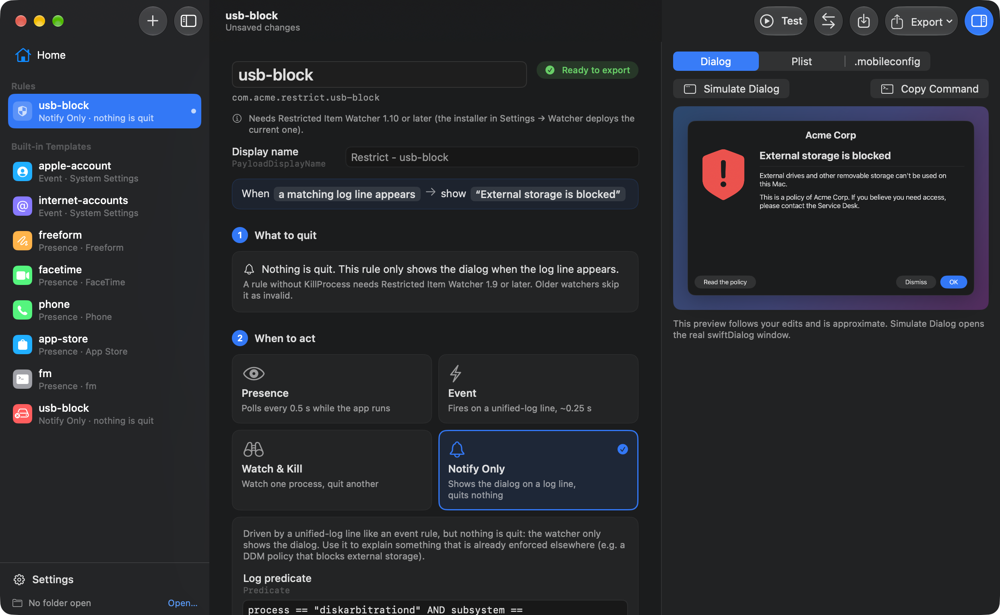
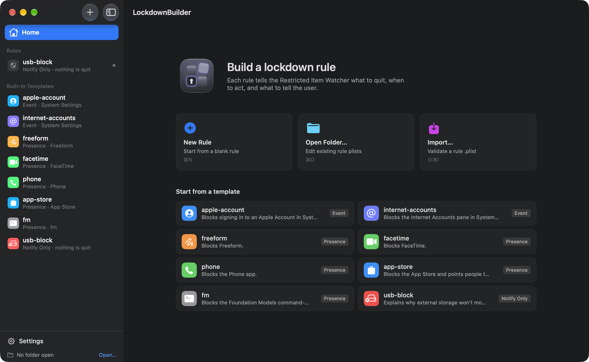
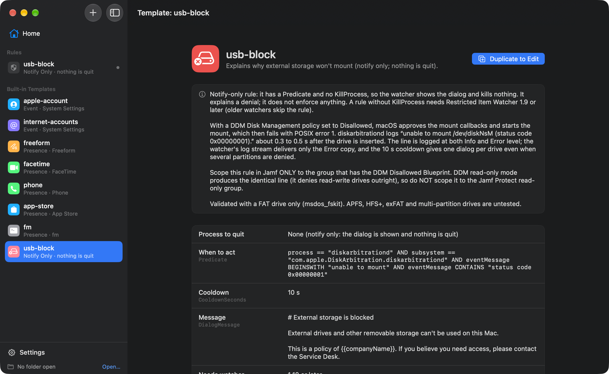
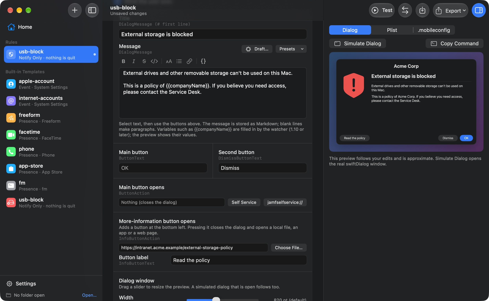
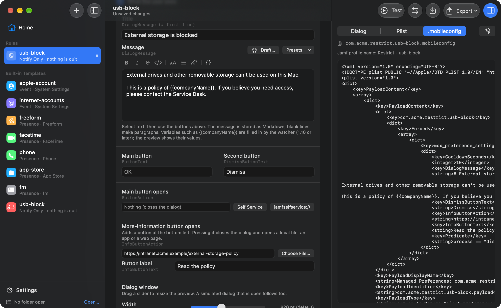
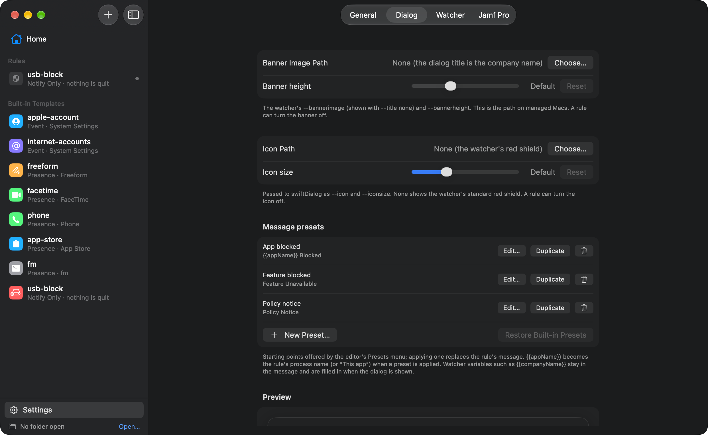
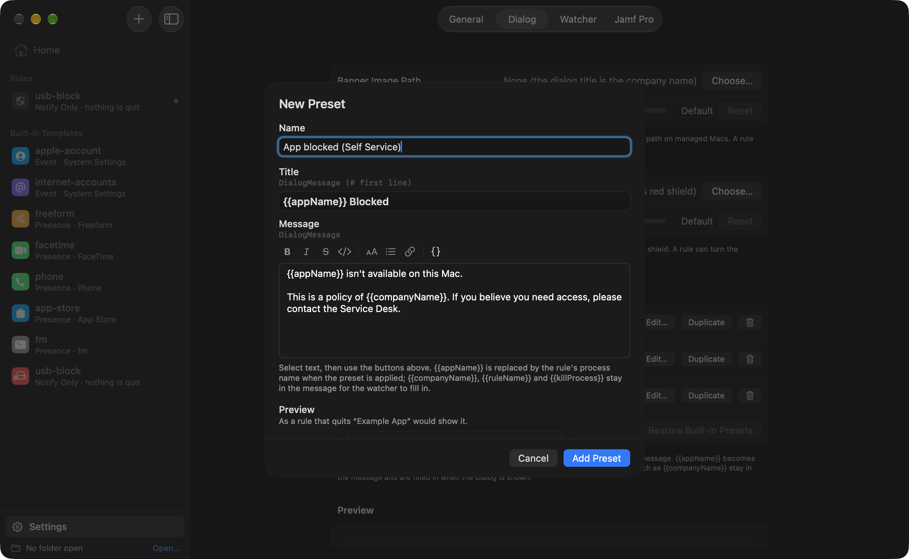
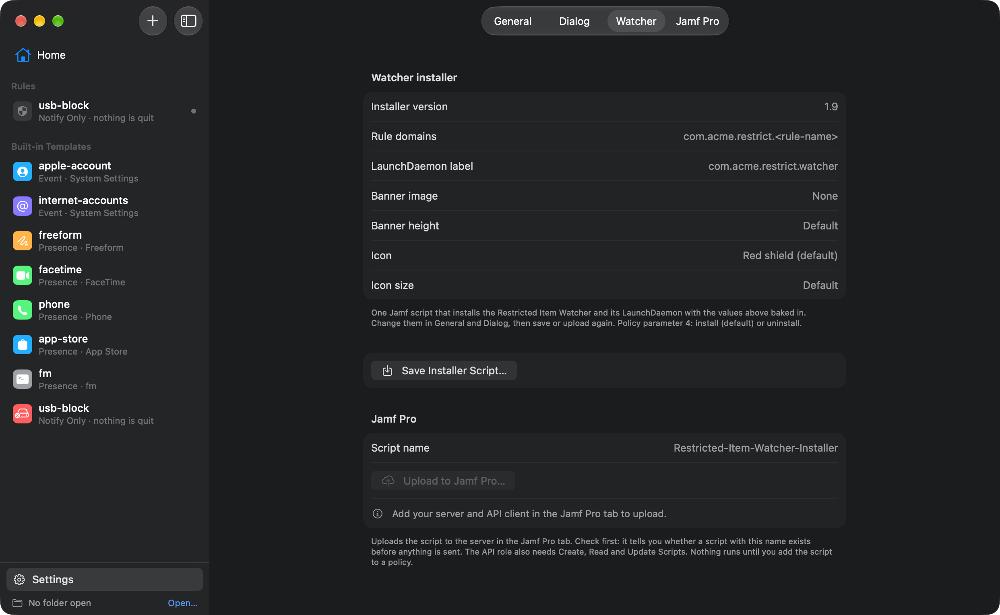

# LockdownBuilder

A native macOS app for authoring, validating, testing and exporting rule files for the **Restricted Item Watcher**
(a Jamf-deployed LaunchDaemon that kills a process and shows a swiftDialog message). The output is a correct rule
`.plist`, ready for Jamf *Application & Custom Settings → Upload*.

The watcher is an alternative to Jamf Pro's **Restricted Software**. It restricts apps and processes the same way, by
quitting them, but tells the user why in a prompt you design: your wording, your banner and icon, and a button that
can take them somewhere useful such as Self Service. It can also act on a single action inside an app (for example
opening one System Settings pane) rather than only on the whole app.

> **Status:** version 1.3. Rule editor, validation, exports, dialog designer with editable message presets, test
> harness, target picker, predicate discovery, Jamf Pro publishing, and optional on-device Apple Intelligence help.

## Download

Each [release](https://github.com/mrheathjones/LockdownBuilder/releases) has the source and, from 1.2, an installer
package (`LockdownBuilder-<version>-unsigned.pkg`) that puts `LockdownBuilder.app` in `/Applications`.

**The package is not notarised.** The app inside is signed with a Developer ID, but the `.pkg` itself is unsigned and
has not been through Apple's notary service, so macOS will refuse to open it on a double-click. Either right-click
(Control-click) the package and choose **Open**, or install it from the Terminal:

```bash
sudo installer -pkg ~/Downloads/LockdownBuilder-1.3-unsigned.pkg -target /
```

If you'd rather not run an un-notarised package, build from source (see [Build](#build)).

## Screenshots



| | |
|---|---|
|  |  |
|  |  |
|  |  |
|  | |

## What's new in 1.3

- **Message preset management.** *Settings → Dialog* lists the message presets: create one from scratch, duplicate a
  built-in and change the copy, edit, or remove any of them, and **Restore Built-in Presets** brings the three
  originals back. The editor's **Presets** menu lists them and adds **Save Message as Preset…**.
- **`{{appName}}` in presets** becomes the rule's process name (or “This app” for a notify-only rule) when the preset
  is applied. Watcher variables such as `{{companyName}}` stay in the message. Rules, plists and the watcher are
  unchanged.

## What's new in 1.2

- **Notify Only rules.** A rule with a `Predicate` and no `KillProcess` shows the dialog when the log line appears and
  quits nothing. Use it to explain something that is enforced elsewhere.
- **usb-block template.** A notify-only rule that tells the user why an external drive did not mount under a DDM
  Disk Management *Disallowed* policy. It enforces nothing; scope it only to the group with that policy.
- **Message variables.** `{{companyName}}`, `{{ruleName}}` and `{{killProcess}}` in the title or message are filled
  in by the watcher when the dialog is shown. The built-in templates and presets use `{{companyName}}`.
- **More Information button.** `InfoButtonAction` adds a button at the bottom left that closes the dialog and opens a
  local file, an app or a web page; `InfoButtonText` sets its label.
- **Watcher 1.10 / installer 1.9.** Notify-only rules need watcher 1.9 or later; variables and the info button need
  1.10 or later. The editor says which version a rule needs.
- The JSON schema requires only `DialogMessage`; the app and the watcher enforce "KillProcess or Predicate".
- First release with an installer package (see [Download](#download)).

Earlier releases: [1.2](https://github.com/mrheathjones/LockdownBuilder/releases/tag/v1.2) (notify-only rules, message
variables, More Information button, first installer package),
[1.1](https://github.com/mrheathjones/LockdownBuilder/releases/tag/v1.1) (redesigned interface,
dialog designer, Publish to Jamf Pro, bundled watcher installer),
[1.0](https://github.com/mrheathjones/LockdownBuilder/releases/tag/v1.0) (first release).

## Add a rule in 2 minutes

1. **⌘N** for a new rule (or pick a built-in template and click **Duplicate to Edit**). Give it a kebab-case name.
2. **KillProcess → Choose…**: pick the running app, drop an `.app`, or type a CLI path. The editor shows whether a
   process with exactly that name is running (`pgrep -x`).
3. **Rule type**:
   - *Presence* for an app: done.
   - *Event* to catch a specific click: **Discover…** → type the action (e.g. "Internet Accounts") → **Start Baseline**
     → **Start Action** → do it once → **Stop**. Click **Test** on the top candidate, repeat the action, and when it
     fires, **Use** it.
   - *Watch & Kill* to watch an extension and kill its host.
   - *Notify Only* to show the dialog on a log line and quit nothing (no KillProcess; needs watcher 1.9 or later).
4. **Dialog**: enter a title and message (pick a preset from the **Presets** menu, or **Draft…** with Apple Intelligence), style the text with the
   toolbar, insert variables such as `{{companyName}}` from the `{}` menu, add a **More Information** button that opens
   a local file or a web page, and set the window's size, position and alignment. The preview follows every edit; **Simulate Dialog**
   opens the real swiftDialog window with the watcher's flags.
5. **⌘E** to export the plist (or `.mobileconfig`), then upload it in Jamf: *Application & Custom Settings → Upload*,
   preference domain = the file name without `.plist`. Optionally upload `restricted-item-rule.schema.json` as the
   custom schema. Or skip the upload: **Export → Publish to Jamf Pro…** (⇧⌘P) sends the `.mobileconfig` straight to
   your server (see below).

## The watcher installer

The app carries the watcher's Jamf installer script (`LockdownBuilder/Resources/Restricted-Item-Watcher-Installer.sh`,
which embeds the watcher itself) and fills in your Settings: company name, preference domain, banner image and height,
icon and icon size. In **Settings → Watcher**:

- **Save Installer Script…** writes the ready-to-deploy script.
- **Upload to Jamf Pro…** creates or updates it as a Jamf script (check first, then create or update). Add the script
  to a policy to deploy; parameter 4 is `install` (default) or `uninstall`.

The banner and icon paths are paths on the managed Macs, so deploy those files there. Watcher 1.8 or later is needed
for the `Dialog*` keys, watcher 1.9 or later for notify-only rules (rules without `KillProcess`; older watchers skip
such a rule as invalid and log it), and watcher 1.10 or later for message variables and the `InfoButton*` keys (older
watchers show `{{…}}` as typed and have no info button). The editor says which version a rule needs.

## Publish to Jamf Pro (optional)

In **Settings → Jamf Pro**, enter your server URL and an API client's ID and secret (Jamf Pro → Settings → API roles and
clients), then **Test Connection**.

### Jamf Pro API role privileges

Create an API role with these privileges, then an API client that uses the role. Nothing else is needed; the app
never reads computers, users or policies.

| Privilege (Jamf Pro → Settings → API roles and clients) | Used by | API calls |
|---|---|---|
| **Read macOS Configuration Profiles** | Test Connection; *Check Jamf Pro* before a publish | `GET /JSSResource/osxconfigurationprofiles`, `GET …/name/<name>` |
| **Create macOS Configuration Profiles** | *Create Profile* (a rule that doesn't exist on the server yet) | `POST /JSSResource/osxconfigurationprofiles/id/0` |
| **Update macOS Configuration Profiles** | *Update Profile* (a rule that already exists, matched by name) | `PUT /JSSResource/osxconfigurationprofiles/id/<id>` |
| **Read Scripts** | *Check* before uploading the watcher installer | `GET /api/v1/scripts?filter=name==…`, `GET /api/v1/scripts/<id>` |
| **Create Scripts** | Uploading the installer for the first time | `POST /api/v1/scripts` |
| **Update Scripts** | Re-uploading the installer under the same name | `PUT /api/v1/scripts/<id>` |

The three *Scripts* privileges are only needed if you upload the watcher installer from Settings → Watcher. Every
session also calls `POST /api/oauth/token` and `POST /api/v1/auth/invalidate-token`, which need no privilege.

- Auth is OAuth client credentials. The client secret is stored in your login keychain, never in preferences or files,
  and every token is invalidated as soon as the request finishes.
- **Publish** is two steps. *Check Jamf Pro* is read-only and tells you whether a profile with that name exists.
  Only then does *Create Profile* or *Update Profile* send anything.
- A new profile is created **with no scope**, so it installs nowhere until you scope it in Jamf Pro. An update replaces
  the name and payload only; scope, category and site are left alone.
- The profile name defaults to `Restrict - <rule-name>` and can be changed per rule; the choice is remembered.

## Apple Intelligence (optional)

On Macs with Apple Intelligence enabled, two features use the on-device model (Foundation Models). Nothing is sent off
the Mac, and you can turn them off in Settings:

- **Draft…** next to DialogMessage: describe what's blocked in one line, pick a tone, and get an editable draft with a
  live preview. It only replaces your message when you click **Use Draft**.
- **Suggest with Apple Intelligence** in discovery: the model picks the most specific of the top ranked candidates
  and explains why. It can't write its own predicate, and its pick can only be used after its live **Test** fires.

Everything else works without it. If it's unavailable, the buttons are disabled and say why.

## Rule format

One plist per rule, named `<ORG_PLIST_DOMAIN>.<PREFERENCE>.<rule-name>.plist` (e.g. `com.company.restrict.apple-account.plist`).

| Key | Type | Required | Notes |
|---|---|---|---|
| `KillProcess` | string | yes, unless `Predicate` is set | Exact process name (`pgrep -x` / `pkill -x`); may contain spaces. An event rule without it is notify-only: the dialog is shown and nothing is killed (watcher 1.9+) |
| `DialogMessage` | string | yes | swiftDialog Markdown; start with `# Title`. May use the variables below |
| `Predicate` | string | no | Unified-log predicate. Present = event rule; absent = presence rule (polled every 0.5 s), which needs `KillProcess` |
| `WatchProcess` | string | no | Presence rules only; invalid together with `Predicate` |
| `CooldownSeconds` | integer ≥ 0 | no | Default 5; rate-limits the dialog only |
| `ButtonText` | string | no | Primary button label, default `OK` |
| `ButtonAction` | string | no | Absolute path or `scheme://…` URL; `file://` and control characters refused |
| `DismissButtonText` | string | no | Adds a secondary button that only closes the dialog |
| `InfoButtonAction` | string | no | Adds a “More Information” button (bottom left). Pressing it closes the dialog and opens this: an absolute path (a local file or app) or `scheme://…` URL, same rules as `ButtonAction` |
| `InfoButtonText` | string | no | Label for that button, default `More Information`; invalid without `InfoButtonAction` |
| `DialogWidth`, `DialogHeight` | integer | no | Dialog size in points (200 or more). Absent: swiftDialog's width, and a height of 500 |
| `DialogPosition` | string | no | `topleft`, `top`, `topright`, `left`, `center`, `right`, `bottomleft`, `bottom`, `bottomright`. Absent: centred |
| `DialogOnTop` | boolean | no | Keep the dialog above other windows. Absent: true |
| `DialogMoveable` | boolean | no | Let the user move the dialog. Absent: true |
| `DialogBlurScreen` | boolean | no | Blur the screen behind the dialog. Absent: false |
| `DialogShowBanner` | boolean | no | Show the banner image. False: the dialog title is the organisation name. Absent: true |
| `DialogShowIcon` | boolean | no | Show the icon. Absent: true |
| `DialogMessageAlignment` | string | no | `left`, `center` or `right`. Absent: left |
| `DialogMessagePosition` | string | no | `top`, `center` or `bottom`. Absent: top |

Rule names are lowercase kebab-case (`^[a-z0-9]+(-[a-z0-9]+)*$`); `watcher` is reserved. `KillProcess` may never be
`launchd`, `kernel_task`, `loginwindow`, `WindowServer`, `bash`, `log`, `dialog` or `Restricted-Item-Watcher.sh`.

**Message variables.** The watcher (1.10+) replaces these in `DialogMessage` when it shows the dialog, so the plist
keeps the token and a renamed company needs no rule changes: `{{companyName}}` (the name the watcher was installed
with), `{{ruleName}}`, `{{killProcess}}` (empty for a notify-only rule). Unknown `{{…}}` tokens are left as typed (the
editor warns), and swiftDialog's own `{computername}`-style variables pass through. The built-in templates and the
message presets use `{{companyName}}`.

**Message presets.** The editor's **Presets** menu inserts a starting message; **Save Message as Preset…** turns the
current message into one. Manage them in *Settings → Dialog*: create a preset from scratch, duplicate a built-in and
change the copy, edit, or remove any of them (**Restore Built-in Presets** brings the three originals back). In a
preset, `{{appName}}` becomes the rule's process name (or “This app” for a notify-only rule) when the preset is
applied; watcher variables such as `{{companyName}}` stay in the message.

A rule needs `KillProcess`, `Predicate` or both. The JSON schema only requires `DialogMessage` (it does not express
"one of the two"); the app and the watcher enforce the rest.

The built-in `usb-block` template is a notify-only rule: it explains why an external drive did not mount when a DDM
Disk Management policy disallows external storage. It enforces nothing. Scope it only to Macs with that policy; the
template's notes in the app give the details.

`Samples/` holds the built-in templates exactly as the app exports them, plus the draft-04 JSON schema for Jamf's custom
schema field. They double as golden files for the tests.

## Build

Requirements: macOS 26+ on Apple Silicon, Xcode 26+ (developed with Xcode 27 on macOS 27). Apple Intelligence is
optional. Pure `.xcodeproj`, no Swift packages,
no third-party dependencies, no telemetry. The only network access is to your own Jamf Pro server, and only when you
test the connection or publish a profile.

```bash
xcodebuild -project LockdownBuilder.xcodeproj -scheme LockdownBuilder build
xcodebuild -project LockdownBuilder.xcodeproj -scheme LockdownBuilder -destination 'platform=macOS' test
```

Warnings are treated as errors. To also run the tests against the real on-device model (needs Apple Intelligence):

```bash
TEST_RUNNER_LIVE_AI=1 xcodebuild -project LockdownBuilder.xcodeproj -scheme LockdownBuilder -destination 'platform=macOS' test
```

To regenerate `Samples/` after an intentional output change:

```bash
TEST_RUNNER_UPDATE_SAMPLES=1 xcodebuild -project LockdownBuilder.xcodeproj -scheme LockdownBuilder -destination 'platform=macOS' test
```

## Keyboard shortcuts

| Shortcut | Action |
|---|---|
| ⌘N | New rule |
| ⌘O | Open a folder of rule plists |
| ⇧⌘I | Import (and validate) plists |
| ⌘S | Save all rules to the folder |
| ⌘E / ⇧⌘E | Export the selected rule as .plist / .mobileconfig |
| ⌘T | Test the selected rule (dry run, simulate dialog, live kill test) |

## Testing a rule locally

**Test (⌘T)** never changes anything unless you ask it to:

- **Dry run** explains what the watcher will do and shows whether a matching process is running now (`pgrep -x`).
  For a notify-only rule it says the dialog is shown and nothing is killed.
- **Simulate dialog** launches `/usr/local/bin/dialog` with exactly the flags the watcher uses. Nothing is killed and
  `ButtonAction` is reported, not opened.
- **Live kill test** (optional, clearly labelled) runs `pkill -x` only after you type the process name exactly.
  It is disabled for rules without `KillProcess`.

## Why it is not sandboxed

The app must run `/usr/bin/log`, `pgrep` and `plutil`, read `/Applications`, and launch `/usr/local/bin/dialog`, none of
which the App Sandbox allows. It is built with the **hardened runtime** and is Developer ID signable. The only
network connections it makes are to the Jamf Pro server you configure, when you test or publish.

## Signing and notarisation

1. Set your Developer ID team in the target's Signing settings (the checked-in team ID is the author's).
2. Archive, then export with *Developer ID* distribution.
3. `xcrun notarytool submit LockdownBuilder.zip --keychain-profile <profile> --wait`, then `xcrun stapler staple LockdownBuilder.app`.

## License

MIT, see [LICENSE](LICENSE).
